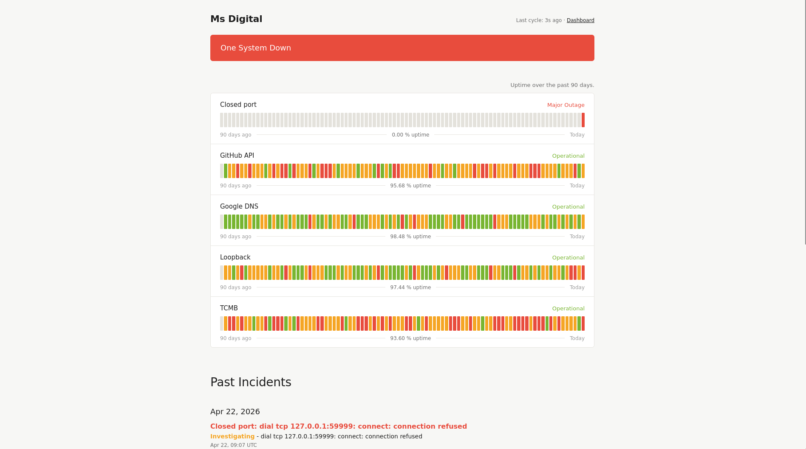

# Statuspage

A small, self-hosted status page written in Go. It periodically pings your services (HTTP APIs, SOAP endpoints, PostgreSQL, Redis, TCP ports, Laravel queues), stores the results in SQLite, renders a clean modern status page, and emails you when something stays broken.



- **One static binary** — no runtime dependencies, no CGO
- **YAML config** — every target is a few lines
- **90-day history** — per-day uptime bars with hover tooltips
- **Email alerts** — only after a configurable "down" threshold, and again on recovery (never duplicated)
- **Basic Auth** — optional, built in

## Install

### `go install`

```bash
go install github.com/Nobody9512/statuspage/cmd/statuspage@latest
```

The binary lands in `$(go env GOBIN)` (usually `~/go/bin/`). Make sure that directory is in your `PATH`.

### From source

```bash
git clone https://github.com/Nobody9512/statuspage.git
cd statuspage
go build -o statuspage ./cmd/statuspage
./statuspage --config config.yaml
```

Requires Go 1.22 or newer.

## Quick start

```bash
# 1. Copy and edit the example config
cp config.example.yaml config.yaml
$EDITOR config.yaml

# 2. Run
statuspage --config config.yaml
```

Open <http://127.0.0.1:8088> in your browser.

## Configuration

All behavior comes from a single YAML file. See [`config.example.yaml`](config.example.yaml) for a fully-commented template.

### Server

```yaml
server:
  listen: "127.0.0.1:8088"
  auto_refresh_seconds: 30
  brand_name: "My Company"        # appears in the page title and header
  basic_auth:
    user: ""                       # leave both empty to disable auth
    password: ""
```

### Scheduler

```yaml
scheduler:
  interval_minutes: 5              # how often each target is checked
  retention_days: 90               # older data is purged daily
  check_timeout_seconds: 10        # per-target timeout
```

### Storage

```yaml
storage:
  sqlite_path: "/var/lib/statuspage/statuspage.db"
```

### Notifier (optional email)

```yaml
notifier:
  enabled: true
  down_threshold_minutes: 15       # wait this long before emailing
  smtp:
    host: "smtp.example.com"
    port: 587
    username: "alerts@example.com"
    password: "…"
    from: "Statuspage <alerts@example.com>"
    to: ["ops@example.com"]
```

Rules:
- **DOWN email** is sent once, after the incident has been open for `down_threshold_minutes`.
- **RECOVERY email** is sent once, when the service is back up (only if a DOWN email was sent).
- No duplicates, no repeated reminders.

### Targets

Every target has a unique `name` and a `type`. Pick the checker that fits.

| `type`         | Required fields         | Optional fields                                                 |
| -------------- | ----------------------- | --------------------------------------------------------------- |
| `http`         | `url`                   | `method`, `headers`, `body`, `expect_status`, `timeout_seconds` |
| `soap`         | `url`, `soap_action`    | `soap_envelope`, `headers`, `timeout_seconds`                   |
| `postgres`     | `dsn`                   | `timeout_seconds`                                               |
| `redis`        | `addr`                  | `password`, `db`, `timeout_seconds`                             |
| `tcp`          | `addr`                  | `timeout_seconds`                                               |
| `laravel_jobs` | `dsn`                   | `fail_threshold`, `stale_reserved_minutes`                      |

`expect_status` defaults to anything in the 200–399 range. Override it when your health endpoint responds with `401`, `422`, or similar on a "live but rejecting unauthenticated" state.

`laravel_jobs` counts rows in the Laravel `failed_jobs` table and in the `jobs` table where `reserved_at` is older than `stale_reserved_minutes`, flagging the queue as DOWN when either crosses the threshold.

See [`config.example.yaml`](config.example.yaml) for a copy-pasteable full example.

## Deploy with systemd

```bash
# 1. Create a dedicated user
sudo useradd --system --home /var/lib/statuspage --shell /usr/sbin/nologin statuspage
sudo install -d -o statuspage -g statuspage /var/lib/statuspage /etc/statuspage

# 2. Install the binary (from `go install` or `go build`)
sudo install -o root -g root -m 0755 "$(which statuspage)" /usr/local/bin/statuspage

# 3. Install the config
sudo install -o statuspage -g statuspage -m 0640 config.yaml /etc/statuspage/config.yaml

# 4. Install the unit file
sudo cp statuspage.service /etc/systemd/system/
sudo systemctl daemon-reload
sudo systemctl enable --now statuspage
journalctl -u statuspage -f
```

Put nginx or Caddy in front of `127.0.0.1:8088` for TLS.

## Storage footprint

Roughly `retention_days × (24 × 60 / interval_minutes) × target_count` rows. With 90 days, 5-minute interval, and 12 targets that is ~310 000 rows or ~60 MB of SQLite.

## License

MIT — see [LICENSE](LICENSE).
